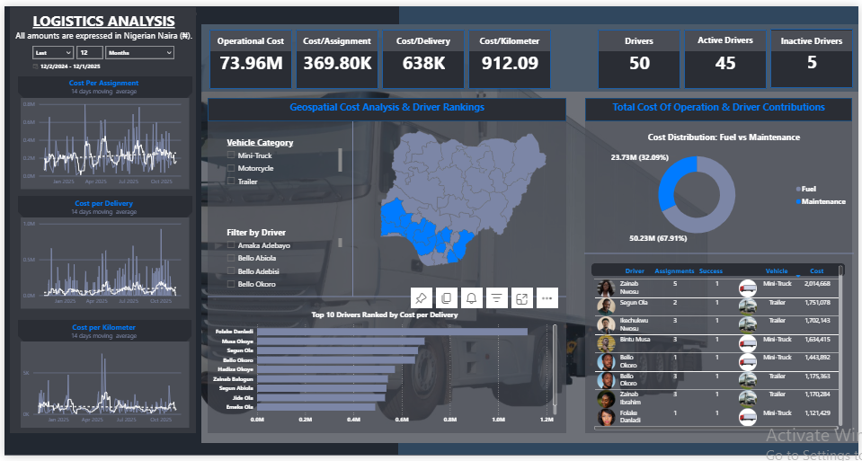

# Logistics Operational Cost Analysis Dashboard

A Power BI project designed to monitor and optimize **fuel & maintenance costs** across a logistics fleet. This solution combines operational transparency with data-driven insights to support better decision-making around vehicle utilization, driver performance, and overall cost efficiency.

---

## Problem Statement

Logistics companies operate in an environment where fuel prices fluctuate, vehicles undergo frequent servicing, and operational costs increase with distance and route complexity. Without centralized visibility, cost leakages easily go unnoticed.  

This dashboard provides **a single source of truth** to answer core operational questions:

- Which vehicles generate the highest maintenance burden?
- Are drivers operating efficiently in terms of fuel consumption per delivery?
- How much does each delivery actually cost?
- Are maintenance activities preventive or reactive — and how is that affecting cost?
- Which stations, routes, and garages have the most financial impact?

---

## Project Objective

To monitor and benchmark **operational cost efficiency** across assignments, drivers, and vehicle categories while enabling strategic fleet management decisions.

---

## Data Sources

The analytical model integrates five main datasets covering operations from assignment creation to delivery completion:

| Table | Description |
|-------|-------------|
| **Fuel Log** | Fuel expense per refuel event including liters, price, and station |
| **Maintenance Log** | Breakdown of repair and servicing cost, type, garage, and urgency |
| **Assignments** | Delivery operations, distance, duration and route characteristics |
| **Vehicles** | Asset details including type, category, and assignment linkage |
| **Drivers** | Operator information and activity count |
| **Customers** | Final delivery destinations and client relationships |

The data model follows a **star schema** linking operational facts to supporting dimensions for efficient analysis.

---

## Data Preparation

The ETL process was completed in **Power Query**, where dates were standardized, ID relationships validated, and routes merged into assignment records. Fuel and maintenance activities were aggregated and mapped to vehicles, enabling automated cost per delivery, per kilometer, and per driver metrics. Derived time intelligence fields helped track delivery time and lateness patterns.

---

## Key Metrics

| Metric | Business Value |
|--------|----------------|
| **Total Operational Cost** = Fuel + Maintenance | Holistic fleet cost visibility |
| **Cost per Assignment** | Profitability of each job |
| **Cost per Delivery** | Delivery-level performance |
| **Cost per Kilometer** | Operational efficiency indicator |
| **Driver Count / Status** | Workforce monitoring |
| **Fuel vs Maintenance Ratio** | Detects inefficiency sources |

---

## Insights & Findings

- Fuel payments contribute the majority of cost variance month-to-month  
- Certain vehicles show recurring emergency repairs → **target for replacement or preventive scheduling**
- A few drivers record consistently higher fuel per km → **requires performance review**
- Cost per delivery spikes in longer routes without proportional revenue  
- Garages vary significantly in cost intensity → **vendor optimization opportunity**

---

## Dashboard Preview

| Operational Cost Dashboard |
|--------------------------|
| 

---

## Tools Used

- Power BI
- Power Query
- DAX
- Excel

---

## Download the Report

You can explore and interact with the full Power BI report:

 `Logistics_Dashboard.pbix` — included in this repository

---

## Future Enhancements

- Integrate **live operational data** using APIs or SQL Server
- Add **profitability metrics** for revenue vs cost margin analysis
- Include **vehicle depreciation** and replacement forecasting

---

